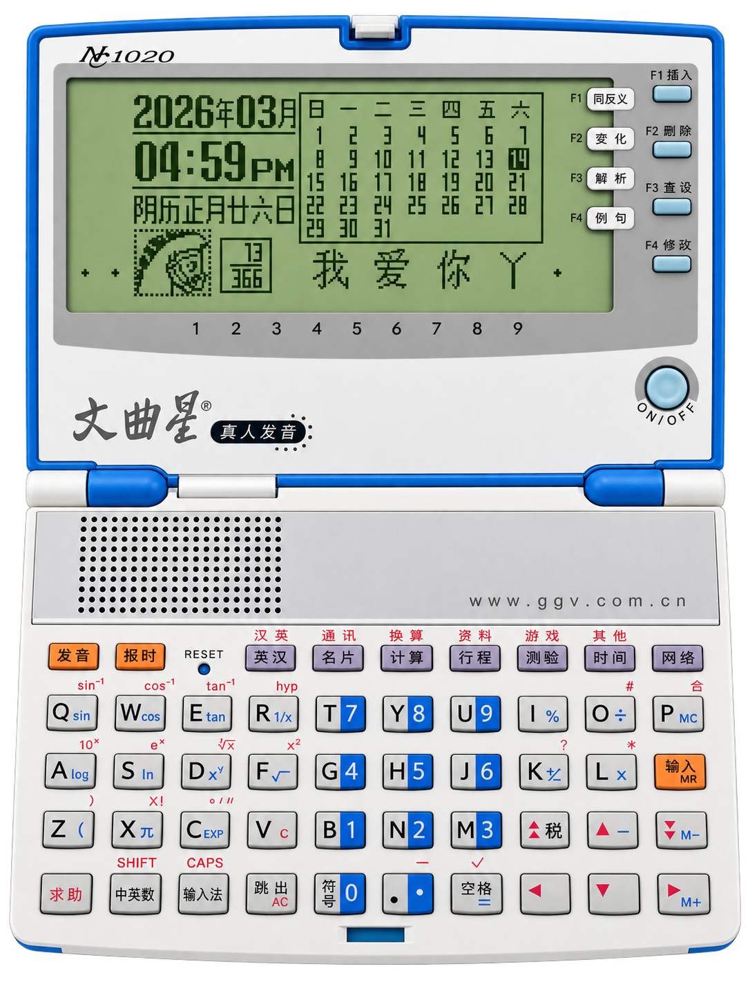
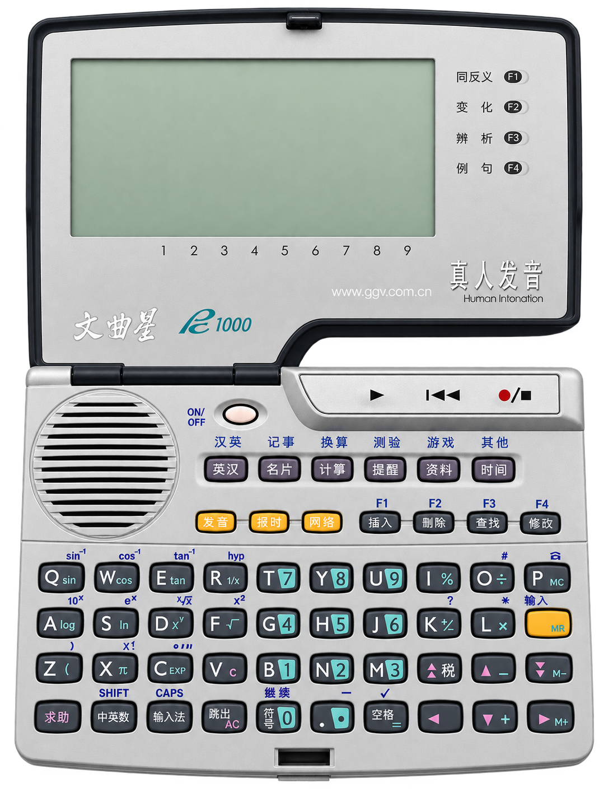
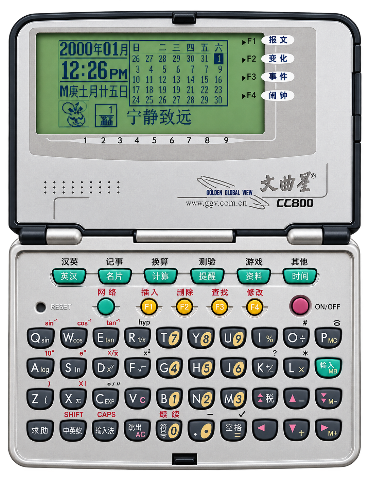
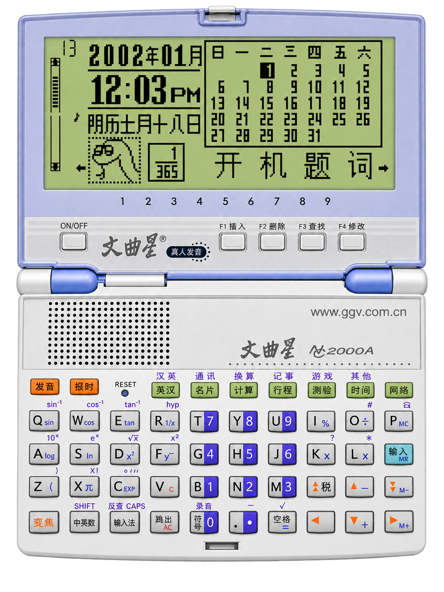
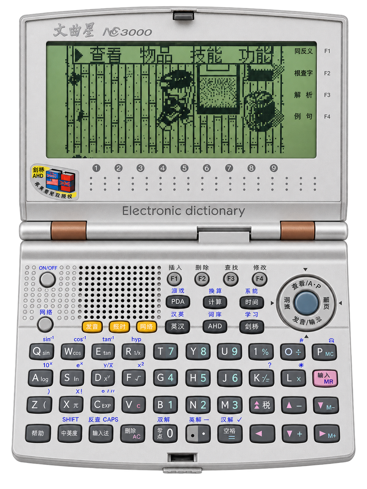

# Compatibility

This document tracks the compatibility status of Wenquxing (文曲星) models with WQXEmu.

## Model Compatibility

| Model | Status | Screenshot | Notes |
|-------|--------|------------|-------|
| NC1020 | ✅ Working |  | Boots to menu, keyboard and NOR work |
| PC1000 | ✅ Working |  | Boots to menu, keyboard and NOR work |
| CC800 | ✅ Working |  | Boots to menu, keyboard and NOR work |
| NC2000 | ✅ Working |  | Boots to clock screen, standby/wake works |
| NC3000 | ✅ Working |  | Boots to clock screen, standby/wake works |

## Status Definitions

| Status | Description |
|--------|-------------|
| ✅ Working | Model boots and runs correctly |
| ⚠️ Partial | Model boots but has issues |
| ❌ Not Working | Model does not boot or crashes |
